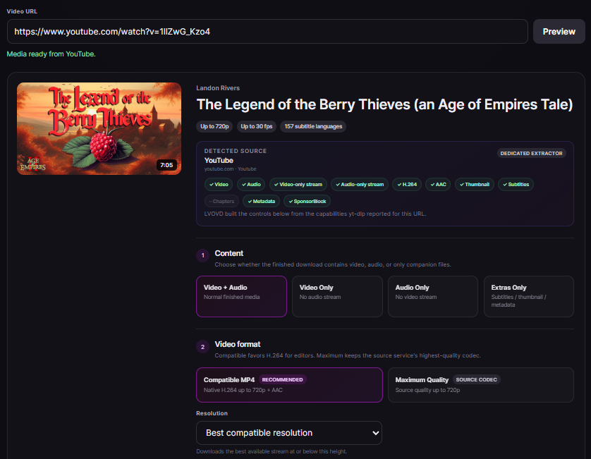

# LVOVD  
## Landon's Very Own Video Downloader

***"A Locally Hosted Video Downloader Which You'll Use Responsibly"***  
You're here because you don't trust any of those browser extensions or sketchy sites right? Well I'm sure you have the good sense to trust yourself, right? *Oh you don't*? Well allow me to further your plight. Anywho, here's some **SLOP** that I made.

  

LVOVD is a local browser UI for **yt-dlp + FFmpeg**. Paste a media URL, preview what the source exposes, choose your download options, and **let your own computer do the work**.

> Use LVOVD only for media you own, public-domain material, or content you otherwise have permission to download. Respect the source service's terms and applicable copyright law.

## Table of Contents

- [Quick Start](#quick-start)
- [What it can do](#what-it-can-do)
- [Source compatibility](#source-compatibility)
- [Download options](#download-options)
- [Privacy and networking](#privacy-and-networking)
- [Authentication and cookies](#authentication-and-cookies)
- [Temporary files](#temporary-files)
- [Manual start](#manual-start)
- [Development](#development)
- [AI-generated project](#ai-generated-project)
- [License](#license)
- [Acknowledgements](#acknowledgements)

## Quick Start

### 1. Install Node.js 22+ and FFmpeg

If you already have both, skip this step.

**Windows 10/11**

```powershell
winget install --id OpenJS.NodeJS.LTS -e
winget install --id Gyan.FFmpeg.Essentials -e
```

Close and reopen your terminal after installation.

**macOS — Homebrew recommended**

Homebrew is the simplest way to install both requirements. If you do not already have Homebrew, install it from https://brew.sh/, then run:

```bash
brew install node ffmpeg
```

You can use Node.js's normal macOS installer instead if you prefer, but Homebrew is still the easiest path for FFmpeg.

**Linux — Debian/Ubuntu example**

The first command adds NodeSource's Node.js 24 LTS package repository. The second installs Node.js (including npm) and FFmpeg:

```bash
curl -fsSL https://deb.nodesource.com/setup_24.x | sudo -E bash -
sudo apt install -y nodejs ffmpeg
```

Other Linux distributions can install **Node.js 22+** and **FFmpeg** with their normal package manager. LVOVD does not require nvm or any particular Node installer.

**Check to see if everything is installed correctly:**

In a terminal, see that these return without errors
```bash
node --version
npm --version
ffmpeg -version
```

### 2. Get LVOVD

**Easy:** [Download the project as a ZIP](https://github.com/landonrivers/LVOVD/archive/refs/heads/master.zip) and extract it.

**Or with Git:**

```bash
git clone https://github.com/landonrivers/LVOVD.git
cd LVOVD
```

The benefit of git is that you'll always have access to the most up-to-date release.
For beginners, I recommend GitHub Desktop as an easy way to clone, manage, and update this project:  
*Github Desktop:* https://desktop.github.com/download/

### 3. Start LVOVD

- **Windows:** double-click `Start-LVOVD-Windows.bat`
- **macOS:** double-click `Start-LVOVD-Mac.command`
- **Linux:** run `./Start-LVOVD-Linux.sh`

The launcher runs `npm install` only when LVOVD's project dependency is missing or needs updating, then starts the server. Keep the launcher terminal open while using LVOVD.

### 4. Open LVOVD

Once the server is ready, the launcher prints both local addresses in the terminal. Click one if your terminal supports clickable links, or copy/paste it into your browser:

```text
http://127.0.0.1:3000
http://localhost:3000
```

## What it can do

- Download **Video + Audio**, **Video Only**, **Audio Only**, or **Extras Only**.
- Prefer editor-friendly **H.264/AAC MP4** when the source provides it, or choose **Maximum Quality** to preserve the best available source streams.
- Export audio as **Source Audio, M4A/AAC, MP3, Opus, FLAC, or WAV**. Converted formats are created locally with FFmpeg after source audio is downloaded.
- Choose a maximum resolution, custom time range, or detected chapters.
- Download thumbnails, metadata JSON, creator subtitles, and automatic captions when available.
- Preview playlists/collections and choose individual entries.
- Optionally use yt-dlp's SponsorBlock integration to mark or remove supported segment categories.
- Show real yt-dlp download progress, speed, ETA, and processing stages.

## Source compatibility

LVOVD does not contain separate downloader code for YouTube, Vimeo, TikTok, Facebook, Instagram, and every other service. It passes the URL to **yt-dlp**, then builds the UI from the metadata and formats yt-dlp returns.

**Preview is the compatibility check.** If yt-dlp can inspect the URL, LVOVD uses that result to decide which controls make sense for that source.

A site appearing in yt-dlp's supported-sites list does **not** guarantee every URL will always work. Extractors and source websites change, and some content requires authentication, browser cookies, or other access that LVOVD does not currently provide.

Current yt-dlp supported sites:
https://github.com/yt-dlp/yt-dlp/blob/master/supportedsites.md

LVOVD does **not** bypass DRM, region restrictions, logins, or access controls.

## Download options

### Video

**Compatible MP4** prefers native H.264 video and AAC audio when available. This is usually the best choice for video editors.

**Maximum Quality** keeps the best qualifying source streams and may use codecs such as VP9, AV1, or Opus that some editors cannot decode even inside an `.mp4` container.

Video-only mode follows the same idea but produces no audio track.

### Audio

**Source Audio** keeps the best available source audio unchanged.

Choosing MP3, M4A/AAC, Opus, FLAC, or WAV still downloads source audio first, then converts the local file with FFmpeg. The selected output format does not change remote media acquisition.

### Extras, ranges, chapters, and subtitles

Where the source exposes them, LVOVD can download thumbnails, metadata JSON, subtitles/automatic captions, custom time ranges, and detected chapters. Chapter and custom-range selection are limited to single-media downloads because timing metadata differs between playlist items.

SponsorBlock is optional and off by default.

## Privacy and networking

LVOVD is **local-first, not anonymous**.

Your browser connects to LVOVD on `127.0.0.1`. The browser displays the interface and receives the finished local file; **Node/yt-dlp running on your computer makes the outbound requests to the source website**.

```text
Your browser
    ↓ localhost
LVOVD on your computer
    ↓
yt-dlp / FFmpeg
    ↓
Source website / media CDN
```

There is no hosted LVOVD backend, account system, analytics service, advertising service, or cloud database. Downloaded media is not uploaded to ChatGPT or OpenAI by LVOVD.

The source website still sees normal network requests from your connection, including information such as your public IP address. Your browser may also keep normal local history/download information depending on its own settings and extensions.

LVOVD is **not** a VPN, proxy, Tor client, anonymity service, DRM bypass, or access-control bypass.

The default server bind is `127.0.0.1`, meaning other computers on your network cannot connect unless you deliberately change `HOST`.

## Authentication and cookies

LVOVD does not currently import browser cookies or your logged-in browser session. Private, age-gated, members-only, or otherwise authenticated media may therefore fail even when yt-dlp recognizes the service.

## Temporary files

LVOVD prepares media under your operating system's temporary directory. Ready files remain available locally for about one hour while the server is running, and the UI provides **Clear prepared files now**. Stale LVOVD working directories are also cleaned on later starts.

Large downloads may require enough free space for both intermediate and finished files.

## Manual start

If you prefer the terminal:

```bash
npm i
npm start
```

Then open `http://127.0.0.1:3000`.

You do **not** need to install yt-dlp globally. The `ytdlp-nodejs` dependency manages LVOVD's project-local yt-dlp executable.

To update that managed yt-dlp later:

```bash
npm run update-ytdlp
```

## Development

```bash
git clone https://github.com/landonrivers/LVOVD.git
cd LVOVD
npm i
npm run check
npm start
```

LVOVD uses Node.js 22+, plain HTML/CSS/JavaScript in `public/`, `server.js` as the localhost security gate, and `app-server.js` for application/download logic. `scripts/launch.js` is shared launcher plumbing behind the three OS-specific start files.

Useful environment variables:

```text
PORT=3000
HOST=127.0.0.1
YTDLP_PATH=/optional/custom/path/to/yt-dlp
```

Keep `HOST=127.0.0.1` unless you intentionally want to change LVOVD's network exposure.

## AI-generated project

LVOVD was initially generated and iteratively developed with **ChatGPT by OpenAI** in collaboration with the project owner. AI-generated code should be reviewed like any other code; contributions that improve correctness, security, maintainability, accessibility, and compatibility are welcome.

## License

MIT. See [LICENSE](LICENSE).

## Acknowledgements

LVOVD is a small UI/orchestration layer around:

- yt-dlp: https://github.com/yt-dlp/yt-dlp
- FFmpeg: https://ffmpeg.org/
- ytdlp-nodejs: https://github.com/iqbal-rashed/ytdlp-nodejs
- SponsorBlock: https://sponsor.ajay.app/
